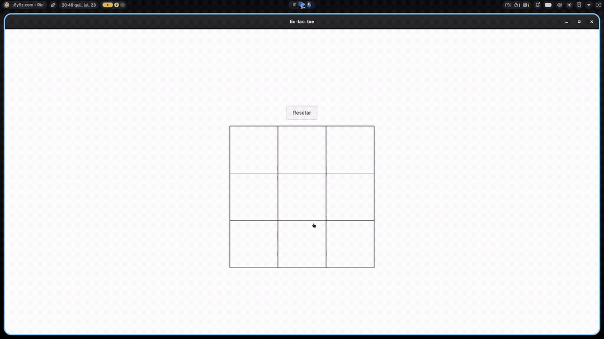

Um projeto simples de jogo da velha para praticar Tauri/Rust

**Demonstração**

**Funcionalidades**
- Jogo da velha para 2 jogadores
- Interface simples e responsiva
**Tecnologias**
- Tauri 2.x (ou a versão utilizada)
- Rust
- HTML/CSS/JS puro

**Pré-requisitos**
- Node.js e npm/pnpm/yarn
- Rust e Cargo
- Tauri CLI (cargo install tauri-cli)
